# Project 2 — Physics of Agents: Opinion Dynamics in an LLM Population

**Author:** *Gabriel Pedde*

**Models:** `qwen2.5` family at five sizes — `0.5b`, `1.5b`, `3b`, `7b`, `14b` — all served via local Ollama. The size sweep  lets us observe how "thermodynamic" behaviour depends on model capacity.

**Code:** [`temperature_sweep.py`](temperature_sweep.py), [`opinion_dynamics.py`](opinion_dynamics.py), [`aggregate_plots.py`](aggregate_plots.py)

---

## 1. Goal

Treat the LLM as a particle in a statistical-mechanics system: ask the same arithmetic question many times, vary the sampling temperature `T`, and study how the output distribution (Part 1) and the inter-agent dynamics (Part 2) change as a function of both `T` and **model size**. The probe is

$$
\frac{T_c}{e} = \frac{2.269}{2.718} \approx 0.8347,
$$

so the variance in the output isolates noise in the *computation step*, not knowledge uncertainty.

- **Part 1:** single agent, 150 samples per temperature, `T ∈ {0.1, 0.3, 0.7, 1.2, 2.0, 3.5, 6.0, 10.0}`.
- **Part 2:** `N = 4` agents, `R = 10` rounds, same temperature grid; from round 1 each agent sees the previous round's peer answers and may revise.

---

## 2. Part 1 — Single-agent temperature sweep

### 2.1 Histograms per temperature

| Model | Histograms |
|---|---|
| `qwen2.5:0.5b`  | 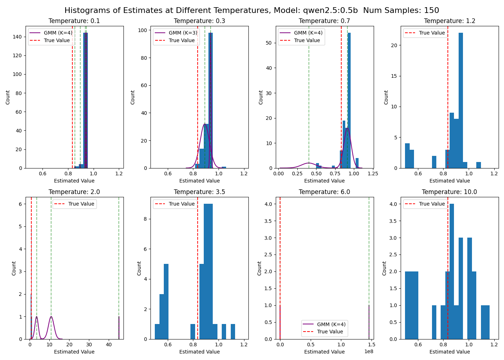  |
| `qwen2.5:1.5b`  | 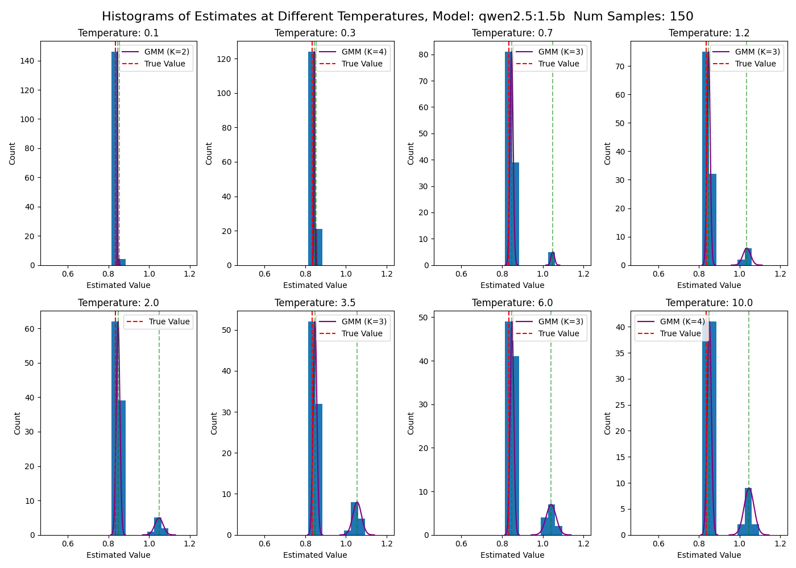  |
| `qwen2.5:3b`    | 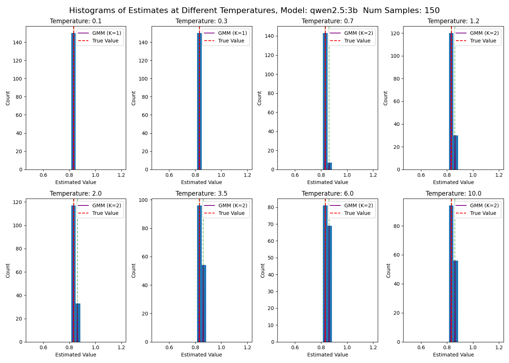    |
| `qwen2.5:7b`    | 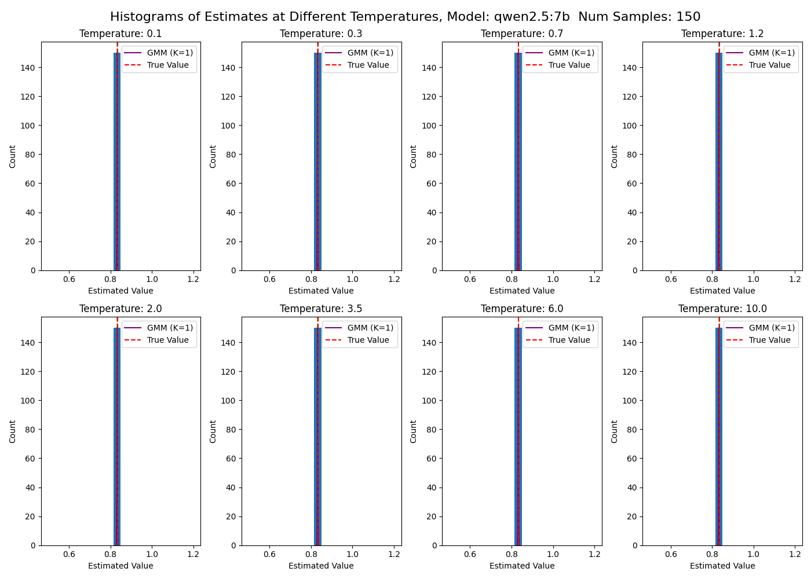    |
| `qwen2.5:14b`   | 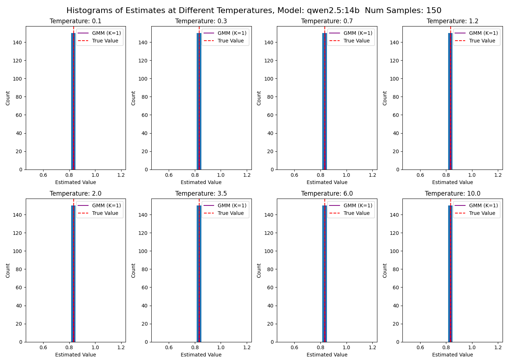   |

### 2.2 Means and discard rate

| Model | Mean / discards |
|---|---|
| `qwen2.5:0.5b`  | 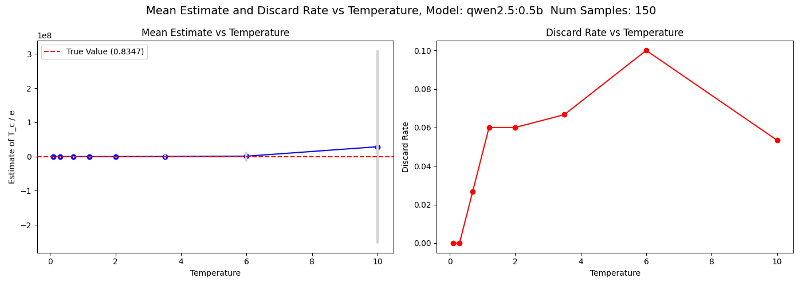  |
| `qwen2.5:1.5b`  | 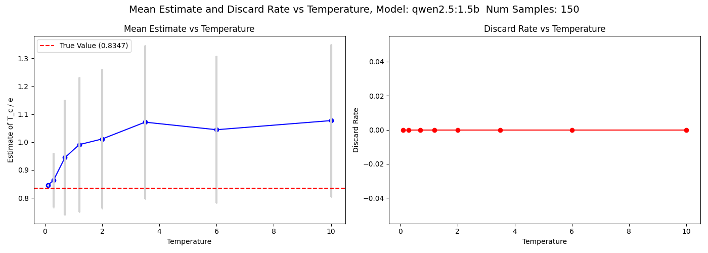  |
| `qwen2.5:3b`    | 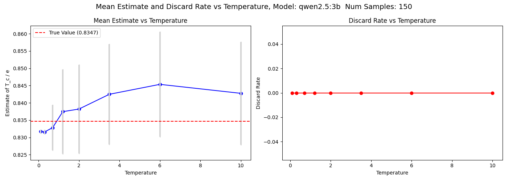    |
| `qwen2.5:7b`    | 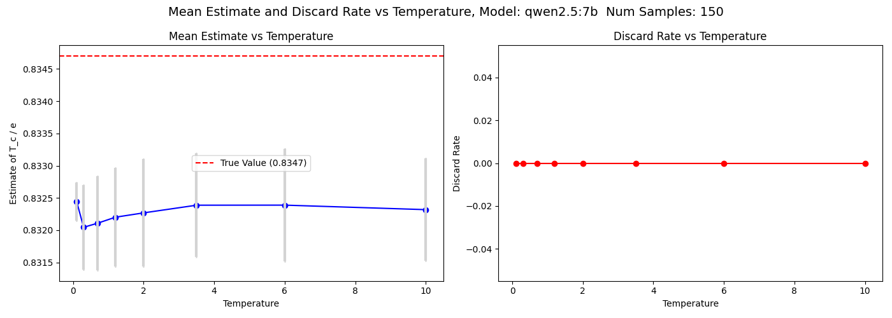    |
| `qwen2.5:14b`   | 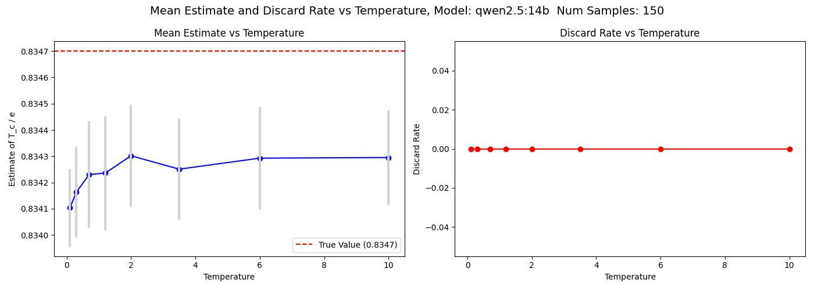   |

### 2.3 Cross-model summary (mean ± std, 150 samples / T)

| T | 0.5b | 1.5b | 3b | 7b | 14b |
|---|---|---|---|---|---|
| 0.1  | 0.933 ± 0.011 | 0.845 ± 0.001 | 0.832 ± 0.001 | 0.832 ± 0.000 | 0.834 ± 0.0002 |
| 0.7  | 1.16  ± 0.97  | 0.945 ± 0.21  | 0.833 ± 0.007 | 0.832 ± 0.001 | 0.834 ± 0.0002 |
| 1.2  | 1.66  ± 1.88  | 0.991 ± 0.24  | 0.837 ± 0.012 | 0.832 ± 0.001 | 0.834 ± 0.0002 |
| 2.0  | 2.89  ± 4.37  | 1.011 ± 0.25  | 0.838 ± 0.013 | 0.832 ± 0.001 | 0.834 ± 0.0002 |
| 3.5  | 3·10⁵ ± 4·10⁶ | 1.071 ± 0.27  | 0.842 ± 0.015 | 0.832 ± 0.001 | 0.834 ± 0.0002 |
| 6.0  | 1·10⁶ ± 1·10⁷ | 1.044 ± 0.26  | 0.845 ± 0.015 | 0.832 ± 0.001 | 0.834 ± 0.0002 |
| 10.0 | 3·10⁷ ± 3·10⁸ | 1.077 ± 0.27  | 0.843 ± 0.015 | 0.832 ± 0.001 | 0.834 ± 0.0002 |

Discard rates (parser failures) stay at 0% for the ≥1.5b models. Only `0.5b` produces unparseable strings, climbing to 10% at T = 6.

---

## 3. Part 2 — Multi-agent opinion dynamics (N = 4, R = 10)

### 3.1 Variance vs round, faceted by temperature

| Model | Variance trajectory |
|---|---|
| `qwen2.5:0.5b`  | 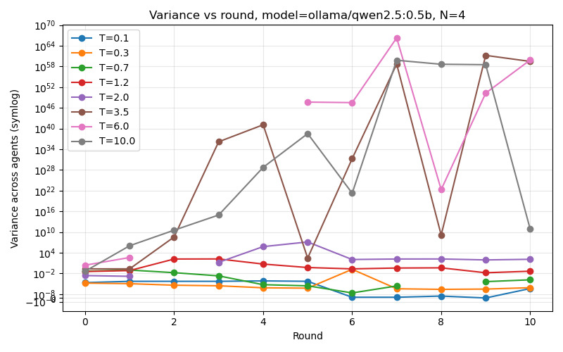  |
| `qwen2.5:1.5b`  | 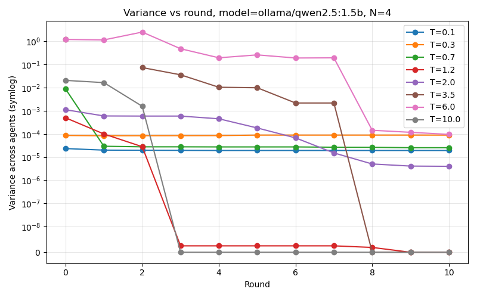  |
| `qwen2.5:3b`    | 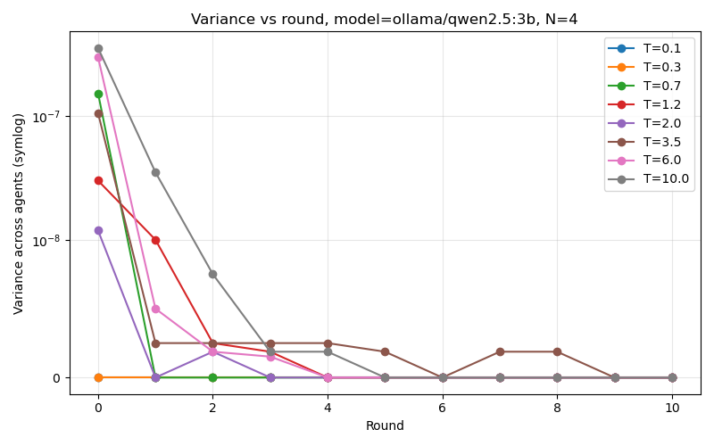    |
| `qwen2.5:7b`    | 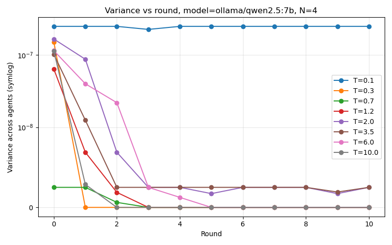    |
| `qwen2.5:14b`   | 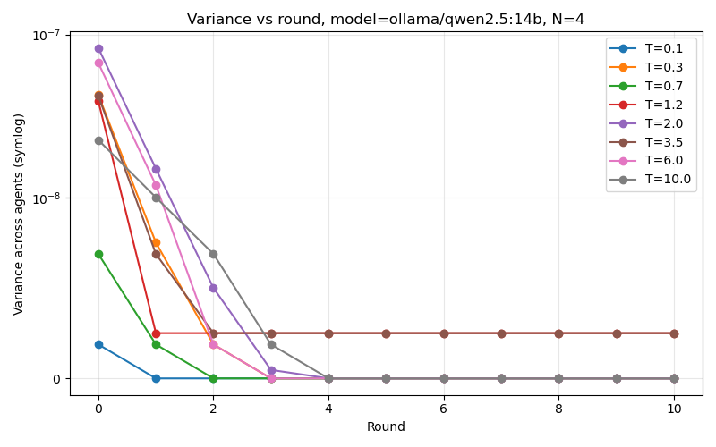   |

### 3.2 Final mean and accuracy (|mean − 0.8347|)

| T   | 0.5b mean / acc | 1.5b mean / acc | 3b mean / acc | 7b mean / acc | 14b mean / acc |
|-----|---|---|---|---|---|
| 0.1  | 0.93 / 0.094  | 1.05 / 0.21  | 0.835 / 7·10⁻⁴ | 0.832 / 3·10⁻³ | 0.834 / 7·10⁻⁴ |
| 0.7  | 0.18 / 0.66   | 1.05 / 0.21  | 0.835 / 7·10⁻⁴ | 0.832 / 3·10⁻³ | 0.834 / 6·10⁻⁴ |
| 1.2  | −0.92 / 1.76  | 1.08 / 0.25  | 0.835 / 7·10⁻⁴ | 0.832 / 3·10⁻³ | 0.834 / 6·10⁻⁴ |
| 2.0  | −12 / 12.5    | 1.06 / 0.23  | 0.835 / 7·10⁻⁴ | 0.832 / 3·10⁻³ | 0.834 / 1·10⁻³ |
| 3.5  | −3·10²⁹ / 3·10²⁹ | 3.07 / 2.23 | 0.835 / 5·10⁻⁴ | 0.832 / 3·10⁻³ | 0.834 / 7·10⁻⁴ |
| 6.0  | −5·10²⁹ / 5·10²⁹ | 1.60 / 0.77 | 0.835 / 7·10⁻⁴ | 0.832 / 3·10⁻³ | 0.834 / 5·10⁻⁴ |
| 10.0 | −3·10⁵ / 3·10⁵ | 1.14 / 0.30  | 0.835 / 7·10⁻⁴ | 0.832 / 3·10⁻³ | 0.834 / 5·10⁻⁴ |

The `≥3b` models reach consensus at round 0 at every temperature; the `1.5b` model converges late and to a wrong value; the `0.5b` model fails to converge at all from `T ≥ 1.2` upward (variance explodes, fed by peer-amplified hallucinated numbers).

## 4. Discussion

The cross-model sweep reveals a clear **capacity-driven phase diagram** rather than a clean temperature-driven one.

- **0.5b — disordered phase at every T.** Already biased at T = 0.1 (mean 0.93) and catastrophically divergent for `T ≥ 3.5`, where individual hallucinated numbers in the millions dominate the population. In the multi-agent setting peer exposure *amplifies* the noise: variance grows with rounds and reaches `~10⁵⁹` at high T. This is the only model where the coupling is dynamically active — and it acts destructively.
- **1.5b — ordered but inaccurate.** Single-agent mean drifts upward monotonically with T (0.85 → 1.08); the multi-agent run converges, but to a wrong consensus around `1.05`. Order ≠ accuracy.
- **3b — ordered + accurate, the lightest model that works.** Single-agent broadens mildly with T (std ≈ 0.015 by T = 10) but the four-agent population locks onto `0.8354` at round 0 for every temperature.
- **7b / 14b — frozen ground state.** The single-agent histograms barely widen across two decades of T. The 14b model sits at `0.8341 ± 2·10⁻⁴` at every T; the 7b model has a small fixed bias of `−2·10⁻³` (a preferred-decimal artefact). The four agents agree at round 0; the coupling has nothing to act on.

**Interpretation in physics terms.** A naïve "T → disorder" picture only holds for `0.5b`. For ≥3b the model is so confident that T can no longer drive a phase transition in the tested range — the system is deep in the ferromagnetic ground state. The genuine control parameter for this experiment is **model size**, not temperature: increasing capacity quenches the system from disordered (0.5b) through ordered-but-biased (1.5b) to ordered-and-accurate (≥3b). The Ising/Naming-Game analogy therefore fits the small models and breaks down for the large ones, where the coupling is a null operation.

---

## 5. Reproducibility notes

- Single-agent: 150 samples × 8 temperatures × 5 models, `think` disabled, `num_predict = 16`.
- Multi-agent: `N = 4` agents, `R = 10` rounds, peer answers from previous round (self excluded). Snapshot read so within-round dispatch is parallel.
- Seeds are not fixed; raw rows are persisted to `data/temperature_sweep_<model>.json` and `data/opinion_dynamics_<model>_T<T>_N4.json`. `aggregate_plots.py` regenerates every figure in `data/` from those files.
